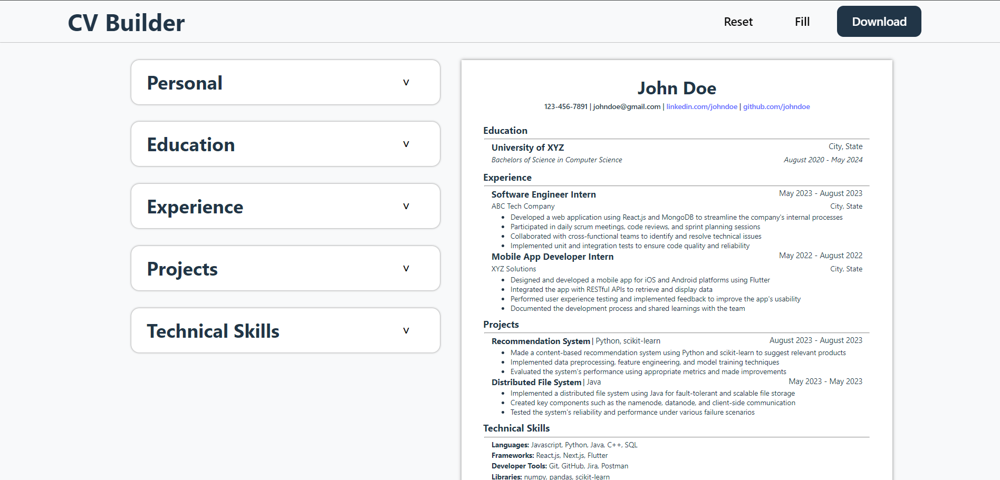

# CV Application

### Description

This simple CV builder was made using React for the front end, and Vite for module bundling and development. The main intent for this project was to practice getting used to React and the `useState` hook. The resume format provided is heavily inspired by [Jake's resume template](https://www.overleaf.com/latex/templates/jakes-resume/syzfjbzwjncs) and as such is mainly geared towards individuals in the tech field.

#### Features:

- Export to PDF
- Sample Resume Preview
- Reset resume to blank template
- Live editing for each resume section

#### Live: https://cv-builder-orpin-eight.vercel.app/

### Resources

- Google Fonts: https://fonts.google.com/
- Jake's Resume Template: https://www.overleaf.com/latex/templates/jakes-resume/syzfjbzwjncs
